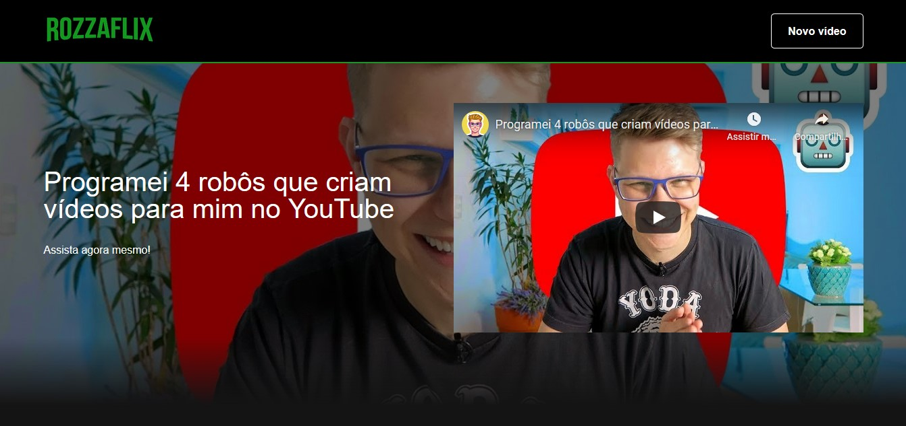
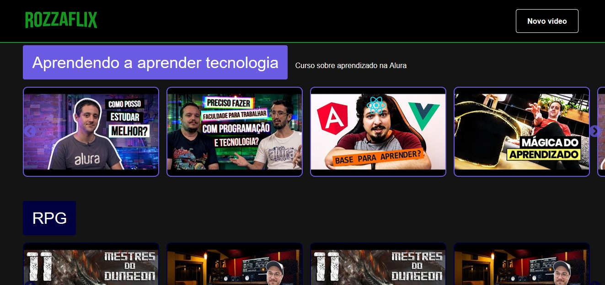
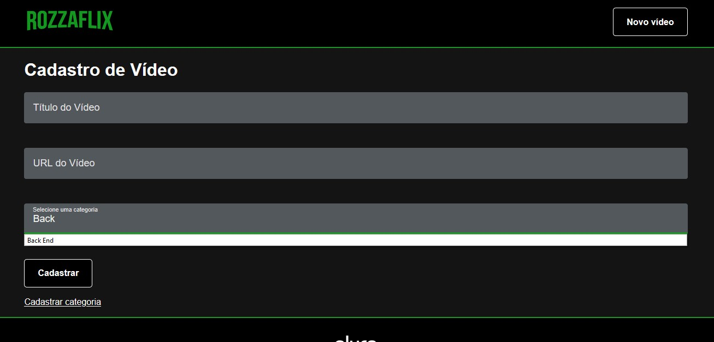
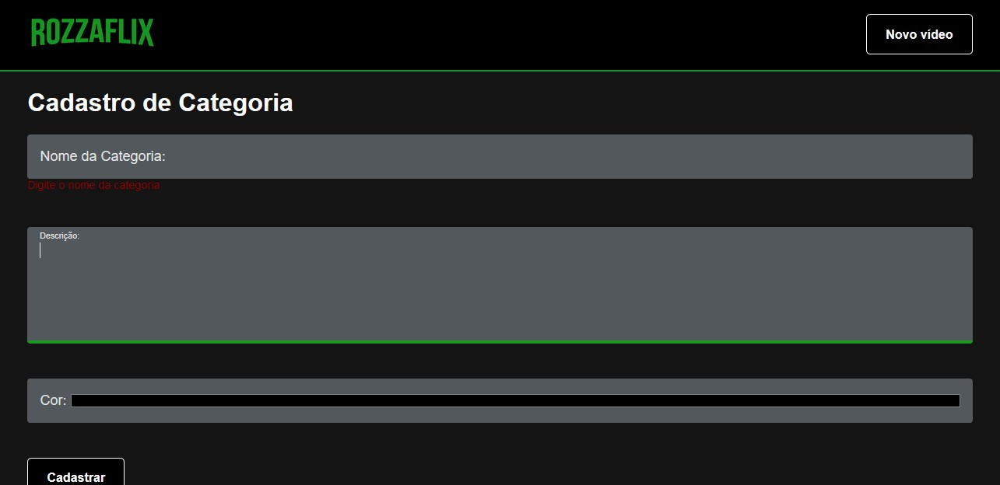

# Imersão Alura

Este projeto cria a Aluraflix (aqui, Rozzaflix), uma plataforma de vídeos de programação e outros assuntos.

O projeto foi desenvolvido durante a Imersão Alura, evento promovido pela Alura Cursos Online, em ReactJS. Aqui, eu desenvolvo a aplicação, porém utilizado Typescript.

## A Plataforma

Rozzaflix é uma plataforma de indexação de vídeos em categorias, como uma criadora de playlists customizada.

Na página inicial, o usuário visualiza todos os vídeos e categorias cadastrados, e pode clicar em um vídeo para mostrá-lo no painel principal, e então assistir seu conteúdo.

Na barra de navegação, é possível acessar a página de cadastro de um novo vídeo, que possui um título, a URL do youtube e a associação com uma categoria.

Se a categoria desejada não existe, é possível clicar no link e cadastrar uma nova categoria.

Ambos os formulários possuem validação de dados, e um vídeo só pode ser cadastrado em uma categoria existente.

## Ferramentas Utilizadas

- **Create React App:** O usual bootstrapper de React, que cria todo o ambiente para inicializar um projeto rapidamente.
- **Styled Components:** Uma ferramenta para criar componentes estilizados usando JavaScript em linguagem CSS.
- **React Slick:** Uma biblioteca para criar um carrossel suave.
- **React Helmet:** Biblioteca para manipular o *head* do HTML, alterando meta e outras informações de cabeçalho com React.
- **Formik:** Biblioteca queridinha de gestão de formulário com React, de forma simples e eficiente.
- **Yup:** Biblioteca de validação de dados, usada nos formulários com Formik.
- **Axios:** Biblioteca que permite realizar requisições HTTP de forma simplificada.
- **React Loading:** Uma biblioteca simples que disponibiliza componentes para elementos de carregamento, como 'spin', 'bubble', etc.
- **Json Server:** Uma biblioteca que permite levantar uma API completa baseada num banco de dado em JSON. Usada para criar nossa pequena API, para testes.

### Desenvolvedor

**Eslint e Prettier:** Padronizadores de código, para garantir legibilidade e boas práticas.
